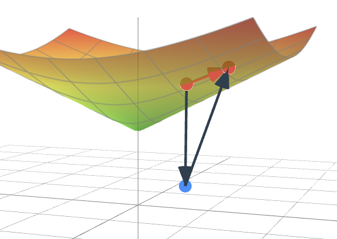

# LorentzKG

This code is the official implementation of the Findings of ACL 2024 paper:

Enhancing Hyperbolic Knowledge Graph Embeddings via Lorentz Transformations.

```
📦kg
 ┣ 📂data
 ┣ 📂manifolds
 ┃ ┣ 📜__init__.py
 ┃ ┣ 📜lmath.py         # Math related to our manifold
 ┃ ┣ 📜lorentz.py       
 ┃ ┗ 📜utils.py
 ┣ 📂optim
 ┣ 📜LorentzModel.py    
 ┣ 📜README.md
 ┣ 📜load_data.py
 ┣ 📜main.py
 ┣ 📜run_fb15k.sh
 ┣ 📜run_wn18r.sh
 ```

## 1. Usage
 To run the experiments, simply run the corresponding training script, e.g.,
 ```bash
bash run_wn18rr.sh
 ```

 You can specify the arguments that are passed to the program:

`--dataset`           The dataset you are going to train the model on. Can be [FB15k-237, WN18RR]      

`--num_epochs`    Number of training steps.

`--batch_size`        Controls the batch size.

`--nneg`              Number of negative samples.

`--lr`                Controls the learning rate.

`--dim`               The dimension for entities and relations.

`--early_stop`        Controls the number of early stop step.

`--max_norm`          Controls the maximum norm of the last n dimension of the n+1 dimension entity and relation embeddings. Set to non-positive value to disable.

`--max_scale`         Controls the scaling factor in Lorentz linear layer.

`--margin`            Controls the margin when calculating the distance.

`--max_grad_norm`     Controls the maximum norm of the gradient.

`--real_neg`          If set, the negative samples will be guranteed to be real negative samples.

`--optimizer`         Optimizer. Can be [rsgd, radam].

`--valid_steps`       Controls the validation interval.

## Figure



## Citation

If you use this codebase, or otherwise found our work valuable, please cite:

```
@inproceedings{fan-etal-2024-enhancing,
    title = "Enhancing Hyperbolic Knowledge Graph Embeddings via Lorentz Transformations",
    author = "Fan, Xiran  and
      Xu, Minghua  and
      Chen, Huiyuan  and
      Chen, Yuzhong  and
      Das, Mahashweta  and
      Yang, Hao",
    editor = "Ku, Lun-Wei  and
      Martins, Andre  and
      Srikumar, Vivek",
    booktitle = "Findings of the Association for Computational Linguistics: ACL 2024",
    month = aug,
    year = "2024",
    address = "Bangkok, Thailand",
    publisher = "Association for Computational Linguistics",
    url = "https://aclanthology.org/2024.findings-acl.272",
    doi = "10.18653/v1/2024.findings-acl.272",
    pages = "4575--4589"
    }
```
